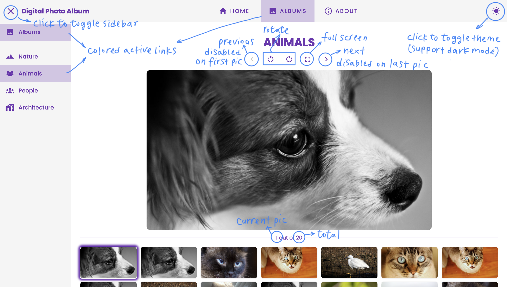
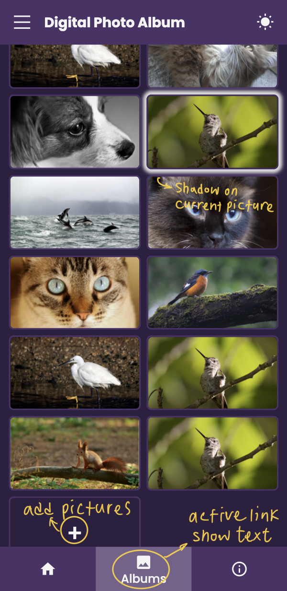

# wp1101 HW2 Digital Photo Album

- [Web Programming Site](https://wp.ee.ntu.edu.tw/)
- [HW2 File](https://ceiba.ntu.edu.tw/course/fdb723/hw/hw2.pdf)

### Basic Feature

- [x] Support RWD (responsive web design)
- [x] Hover & Active Effect
- [x] Multiple Albums
- [x] Warning Message when clicking on the empty album

### Additional Feature

- [x] Support system color theme (light & dark) and theme toggling
- [x] Show the total number of the picture and the number of the current picture
- [x] Add image to the album
- [x] Ripple effect on button
- [x] Routing in Single Page (with hash history)
- [x] Support rotate, next, previous, and fullscreen on display image

### Browser Support

- Better Support: Chrome

### Directory Struecture

```
 hw2/
├──  screenshots/
│  ├──  desktop_light.png
│  └──  mobile_dark.png
├──  README.md
├──  index.html
├──  main.js
└──  styles.css
```

### Screenshot

- Light mode on Desktop: 

  

- Dark mode on Mobile: 

  