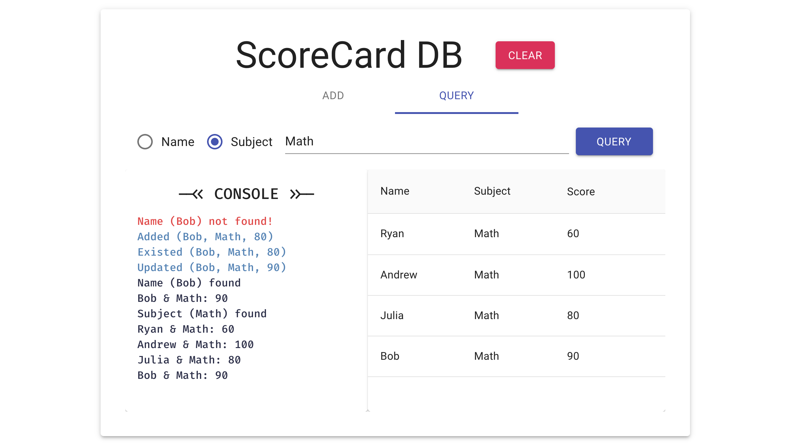

# wp1101 HW7 Number Guessing Game

- [Web Programming Site](https://wp.ee.ntu.edu.tw/)
- [HW7 File](https://ceiba.ntu.edu.tw/course/fdb723/hw/hw7.pdf)

### Get Started

To get started, you need to `yarn install:all` then `yarn start` and `yarn server` in different terminal tabs.

### Screenshot

### Basic Features

- [x] **Clear** to clear database and console
- [x] **Add** to write to database (add / update / existed)
- [x] **Query** to query database

### Advances Features

- [x] two tabs (but I think sharing same console and table is more clear)
- [x] table for **Add**
- [x] table for **Query**
- [x] sorting in table
- [x] UI improvement: not much (console, table, tabs, fixed height)
- [x] UX improvement: MUI UI experience is already wonderful