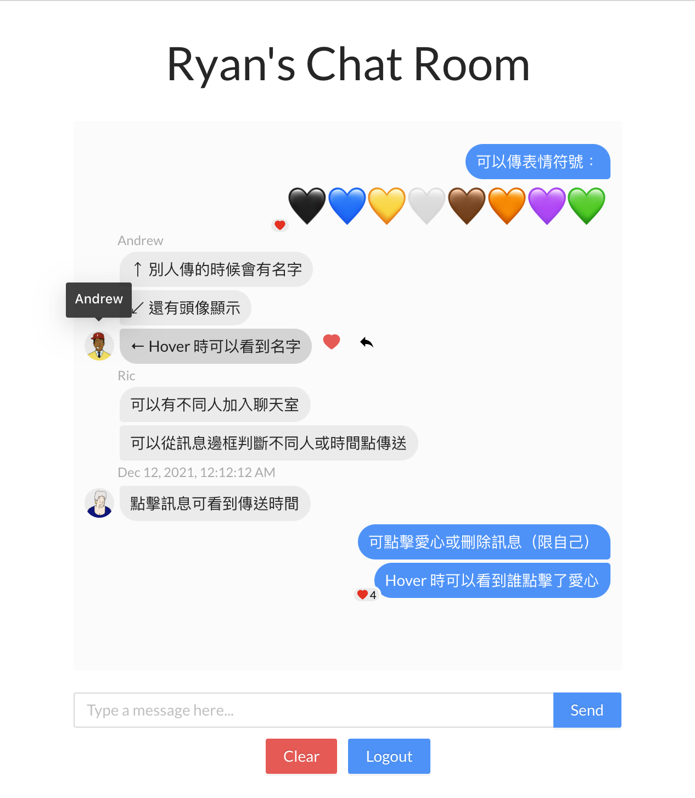

# wp1101 HW8 Number Guessing Game

- [Web Programming Site](https://wp.ee.ntu.edu.tw/)
- [HW8 File](https://ceiba.ntu.edu.tw/course/fdb723/hw/hw8.pdf)

### Get Started

- To get started, you need to `yarn install:all` then `yarn start` and `yarn server` in different terminal tabs.
- To have a fast setup, you can uncomment the 29th line in `backend/server.js` to initialize the sample data!

### Screenshot

	

### Basic Features

- [x] Sign in to the Chat Room.
- [x] Use localstorage to store login state and username.
- [x] Load all message when login is successful.
- [x] Group message.
- [x] Clear button.
- [x] display message for each status (login, logout, error, sent, clear,...).
### Advances Features

- [x] BEAUTIFUL UI/UX.
- [x] Can distinguish emoji and text.
- [x] Like button for each message.
- [x] Delete button for each message send by the user him/herself.
- [ ] Reply button for each message. (not implement yet)
- [x] Tooltip for name, action, and whom who liked the message.
- [x] Click to see the timestamp of the message.